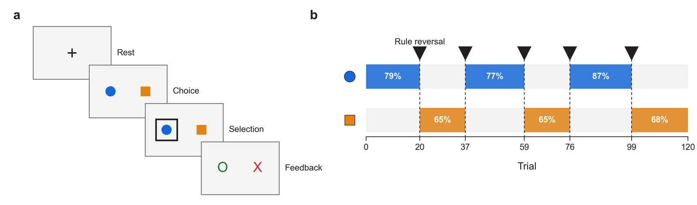
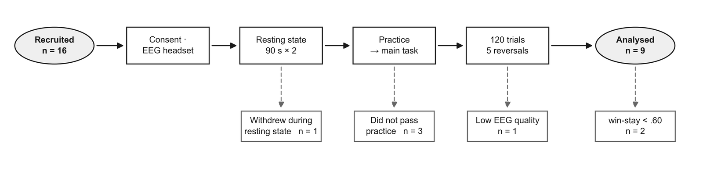
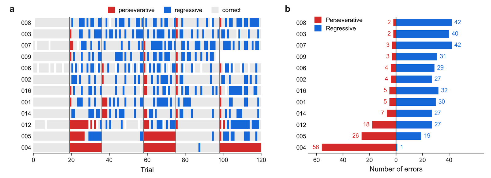
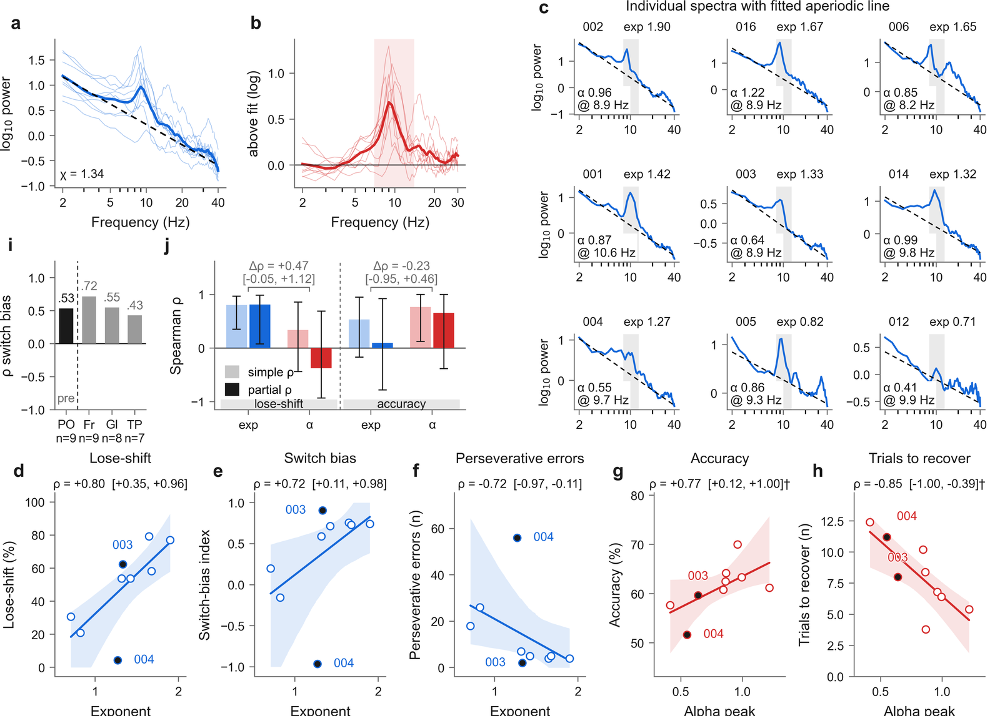
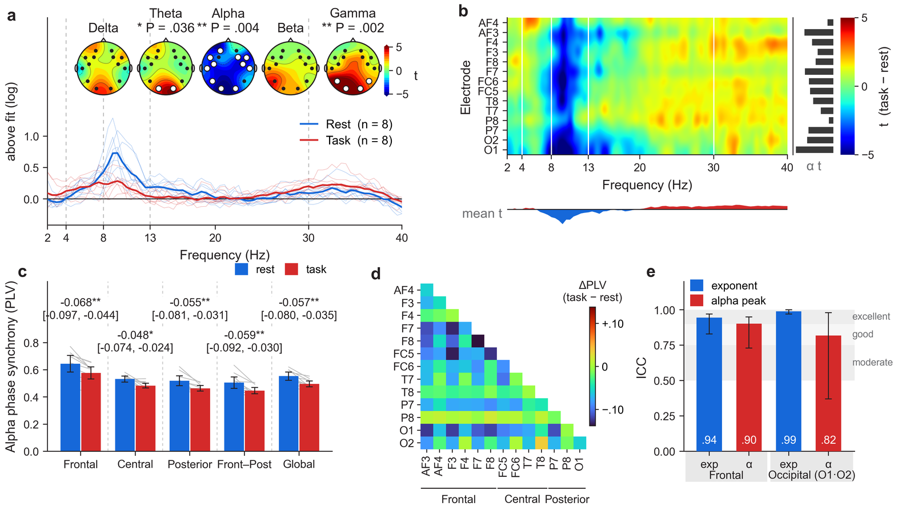
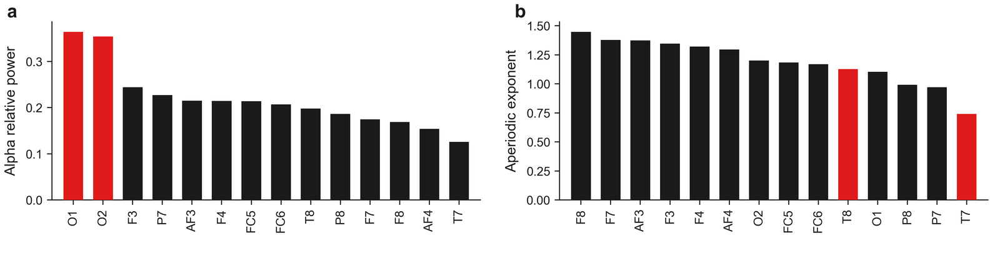

<h1 align="center">Responses of adults with developmental disabilities<br>when rules change without warning</h1>

<p align="center">
  Analysis code for a probabilistic reversal-learning task with resting-state and task EEG<br>
  <sub>16 adults with developmental disabilities · Emotiv EPOC X, 14 channels · preregistered study</sub>
</p>

<p align="center">
  
  
  
  
</p>

---

## What this repository does

It regenerates **every number and all six figures** in the manuscript from the raw
recordings.

| | |
|---|---|
| **Behaviour** | perseverative / regressive error classification, switch-bias index, lose-shift, win-stay, trials to recover |
| **Resting-state EEG** | aperiodic exponent and alpha peak (FOOOF / specparam), per-channel indices, between-run reliability |
| **Task EEG** | band-relative power, phase-locking value (PLV) and network metrics, feedback-locked theta |
| **Preregistered tests** | H1, W1, W2; the 144-cell specification grid; cluster-based permutation |
| **Multiple comparisons** | Benjamini–Hochberg q within families — emits the full 52-row P/q table |

**Reproducibility conventions.** Every bootstrap uses 10,000 participant resamples
with seed 1, discarding resamples that contain fewer than 4 distinct participants.
All six figures are written 173 mm wide at 600 dpi, and text uses only the three
sizes defined in `natstyle.py` (9 / 7 / 6 pt).

---

## Figures

All six figures in the manuscript are produced by the code here. Each script also
writes the values printed on the figure to a `.json` file of the same name, so the
caption can be checked against the data.

### Figure 1 — Task structure



Resting-state measurement and the flow of a single trial (a); the reversal schedule
across 120 trials with the realised reward rate per segment (b). There are five
reversals, and the schedule is fixed with seed 0 so that every participant saw the
same order.
→ `scripts/6_figures/fig1_task.py`

### Figure 2 — Session procedure and participant flow



From the 16 participants recruited to the analysed samples, with exclusions at each
stage.
→ `scripts/6_figures/figM_flow.py`

### Figure 3 — Distribution of error types



Trial-by-trial record per participant (a) and error composition (b). **The amount of
error was similar across participants (mean 40.2), but the kind of error split in
opposite directions** — the switch-bias index ranges from −0.96 to +0.91. This is
where the study starts.
→ `scripts/6_figures/fig3_errors.py`

### Figure 4 — Resting-state EEG and behaviour



Frontal spectra with the aperiodic fit (a–c), correlations by cluster and partial
correlations (i–j), and resting-state indices against behavioural indices (d–h).
**The aperiodic exponent tracks the *direction* of responding, while alpha peak
amplitude tracks the *level* of performance** — two spectral components mapping onto
different behavioural dimensions.
→ `scripts/6_figures/fig4_full.py` (scatter panels alone: `fig4_scatter.py`)

### Figure 5 — From rest to task



Flattened spectra with scalp topographies by band (a), electrode × frequency paired
t (b), alpha PLV by region (c), the electrode-pair ΔPLV matrix (d), and between-run
intraclass correlations (e). **Moving into the task, alpha activity and inter-region
alpha synchrony fall together in nearly every participant** (80 of 91 pairs).
→ `scripts/6_figures/fig5_full.py`

### Figure S1 — Alpha and aperiodic exponent by channel



Alpha relative power is largest at occipital sites, and the aperiodic exponent
differentiates along the anterior–posterior axis. A check that a consumer-grade
14-channel system still reproduces the classical spatial pattern.
→ `scripts/6_figures/figS2_channels.py` (the filename carries an earlier figure
number)

---

All six are **4,080 px wide = 6.8 in = 173 mm at 600 dpi**. Text uses only the three
sizes in `natstyle.py` — panel letters 9 pt bold, axis and panel titles 7 pt, tick
labels, legends and annotations 6 pt. Nothing is set below 6 pt. Because the width is
fixed, the point size written in a script is the point size that prints.

<sub>The images above are downscaled to 1,600 px for this page (`docs/figures/`).
Run `run_all.py` to write the print-resolution originals to `outputs/`.</sub>

Two helpers sit alongside them. `natstyle.py` holds the specification above, and
`fig4_scatter.py` produces the scatter panels d–h on their own; `fig4_full.py`
imports its sizing and point-labelling rules from it.

---

## Quick start

```bash
git clone https://github.com/JeongNeuro/reversal-learning-eeg.git
cd reversal-learning-eeg
pip install -r requirements.txt

# put the raw recordings in data/ — see data/README.md

python run_all.py              # regenerate all figures and numbers
python run_all.py --check      # recompute every value against the spreadsheet
python run_all.py --skip-slow  # skip the stages that re-read the EDF files
```

Output is written to `outputs/`. To use other locations:

```bash
export ASD_DATA=/path/to/data
export ASD_OUT=/path/to/output
```

Two further variables matter only for the optional inputs. `ASD_XLSX` points at the
team's internal workbook, which only `excel_recompute.py` reads. `ASD_XLSX_SHEETS` and
the `ASD_DISABILITY_*` variables are needed only when those optional inputs are written
in a language other than English - see [data/README.md](data/README.md).

---

## Layout

```
run_all.py            full regeneration — runs the six stages in order
paths.py              path configuration shared by every script
cohort.py             sample definition and behavioural indices, in one place
scripts/
  1_preprocess/       EDF to spectra, connectivity and trial-level indices
  2_metrics/          cluster indices and network recomputation
  3_hypotheses/       preregistered hypotheses; P values and q within families
  4_validation/       feasibility, model checks, reliability
  5_exploratory/      analyses not in the preregistration
  6_figures/          manuscript figures (natstyle.py holds the specification)
task/                 the PsychoPy task given to participants, with its fixed schedule
docs/figures/         figures for this page (1,600 px wide)
data/                 raw recordings — never committed
outputs/              generated files — never committed
```

`cohort.py` sits at the root for a reason. Exclusion criteria used to be applied
separately inside each script, and as a result one participant who fails the
reaction-time criterion survived into some analyses but not others. Sample decisions
now live in a single file.

---

## Scripts

### Behaviour — needs only the trial-level CSV

| Script | What it does | Output |
|---|---|---|
| `behav_metrics.py` | every behavioural index in the manuscript (perseverative and regressive counts, switch-bias index, lose-shift, win-stay, accuracy, switch rate, trials to recover, reversal manipulation check) | `behav_metrics.json` |
| `rlmodel.py` | reinforcement-learning model fit (not used in the main text; see the supplement) | `rlfit.json` |

### Behaviour — needs the trial-level CSV and the spreadsheet

| Script | What it does | Output |
|---|---|---|
| `persev_direct.py` | perseveration indices such as run length and reversal crossing; sliding-window lose-shift trajectories | `persev.json` |
| `trajectory.py` | reversal-locked learning curves | `trajectory.json` |

### Preprocessing — needs the raw EDF

| Script | What it does | Output |
|---|---|---|
| `spectro.py` | resting-state spectra — aperiodic exponent, alpha peak, band power, per-channel indices | `spectro.json`, `flatspec.json`, `psd_all.json`, `psd_rest.json`, `bandpow.json`, `chan_indices.json`, `chan_peak.json`, `chan_exp_rest.json` |
| `connectivity.py` | phase-locking value by channel pair and frequency band | `conn.json` |
| `tfr.py` | trial-level time–frequency decomposition | `tfr.json` |
| `w1.py` | aperiodic exponent in the windows around each reversal | `w1.json` |
| `phases.py` | indices by learning phase | `phases.json` |
| `timescale.py`, `timescale_checks.py`, `timeseries.py` | autocorrelation time constants and related supplementary analyses | JSON of the same name |

### Recomputation

| Script | What it does | Input needed |
|---|---|---|
| `excel_recompute.py` | recomputes the manuscript's descriptives, correlations, partial correlations, Steiger tests, ICCs and sensitivity analyses from the spreadsheet alone | spreadsheet |
| `network_recompute.py` | network metrics (weighted path length, clustering coefficient, node degree) with bootstrap intervals | `conn.json` |
| `resolve_B.py` | individual alpha frequency, alpha peak power, learning phase and correct-versus-error comparisons, under each candidate definition | `psd_all.json`, `phases.json`, `tfr.json` |

### Supplementary analyses (not used in the main text)

| Script | What it does | Output |
|---|---|---|
| `hmm_validate.py` | hidden Markov model checks (BIC, restarts, initial values, simulated data) | `hmm_valid.json` |
| `subtype.py` | clustering of participant profiles | `subtype.json` |
| `subtype_validate.py` | whether those clusters are discrete (resampling, gap statistic, confounds) | `subtype_valid.json` |
| `ts_stats.py` | trial-level sliding-window statistics and time-point cluster permutation | `ts_stats.json`, `FigS_ts_individual.png` |

### Recomputed against the preregistration

| Script | What it does |
|---|---|
| `w2_theta.py` | W2 — feedback-locked frontal theta, compared across baselines (requires rerunning `tfr.py`) |
| `a7_mantel.py` | A7 — behaviour ↔ EEG Mantel test across the four clusters of §18.6 |
| `prereg_clusters.py` | A4 and A5 — recomputed with the registered alpha definition and registered clusters |
| `w1_prereg_windows.py` | W1 — rebuilds the stable and post-reversal windows from the raw data (§29.2, needs EDF) |
| `w1_prereg.py` | W1 — mixed model across the four clusters. The coefficient is always `post − stable` |
| `w2_boot_p.py` | W2 three-level contrasts — bootstrap P by the **same method** as the interval |
| `robustness.py` | Appendix 1 robustness — correlations by sample, leave-one-participant-out, age as a confound |

### P values and multiple comparisons

| Script | What it does | Output |
|---|---|---|
| `pvalues.py` | exact P per result and Benjamini–Hochberg q within families | `pvalues.csv`, `.txt` |
| `topo_cluster_perm.py` | cluster-based permutation for the topographies in Figure 5a | `topo_cluster_perm.csv` |

Asterisks come from the `q` column of `pvalues.csv`; no significance marker is
hard-coded in a figure script. Only the three preregistered primary tests
(H1, W1 parieto-occipital, W2 frontal) are judged on the uncorrected P.

### The task program

`task/` holds the PsychoPy script presented to participants. **Perseverative and
regressive errors are classified by the task program rather than by the analysis
code** (`ErrorClassifier` in `prl_task.py`), and the result is stored in the
`error_type` column of the trial record. The trial schedule is fixed with seed 0, so
every participant experienced the same order; `seed0_schedule.csv` is included so
that this can be checked.

### Figures and the manuscript

The original figure code did not survive, so **all six figures were rebuilt in this
repository.** Coordinates, text sizes, line widths and colours were matched by
extracting the figures from the manuscript PDF and **measuring them pixel by pixel**.
Every value that appears in a figure is computed from the data; none is hard-coded.

`FigS_ts_individual.png`, produced by `ts_stats.py`, is not part of the submitted
manuscript. It remains here, together with the time-point cluster permutation, as a
supplementary analysis.

---

## Spectral pipeline

`scripts/1_preprocess/spectro.py` was rewritten because the original code did not
survive.

```bash
python scripts/1_preprocess/spectro.py                   # main analysis
python scripts/1_preprocess/spectro.py --min-epochs 15   # recommended, see below
python scripts/1_preprocess/spectro.py --ica             # ICA sensitivity
python scripts/1_preprocess/spectro.py --sensitivity     # full grid
```

### Where it departs from the reference document

Three things differ, and the reasons are recorded here.

**Bad channels are detected on a separate copy of the signal.** Reference §3.2 asks
for a 0.5 Hz high-pass only, while §3.3 asks us to reproduce a specific set of bad
channel rates (P8 51.6%, AF4 41.9%, F7 and T8 6.5% each). The two requirements cannot
both hold. Testing the conditions separately:

| Filter | First 10 s | F7 | P8 | AF4 | T8 |
|---|---|---|---|---|---|
| 0.5 Hz high-pass | dropped | 12.9% | 51.6% | 41.9% | 6.5% |
| 0.5 Hz high-pass | kept | 9.7% | 51.6% | 45.2% | 6.5% |
| 1–45 Hz + notch | dropped | 12.9% | 51.6% | 48.4% | 6.5% |
| **1–45 Hz + notch** | **kept** | **6.5%** | **51.6%** | **41.9%** | **6.5%** |
| target | | 6.5% | 51.6% | 41.9% | 6.5% |

Only the last condition matches all four rates, which means the original code filtered
1–45 Hz rather than following §3.2. So **detection runs on the 1–45 Hz copy while the
spectra are computed on the 0.5 Hz high-passed copy** required by §3.2. Detection is a
judgement about electrode contact, so a band-limited signal is the appropriate place
to make it, and this keeps the published quality table directly comparable.
Use `--detect-filter spec` to detect on the §3.2 filter instead.

**A minimum of 15 epochs is recommended.** The 30 epochs of §3.4 require 75% of the 40
epochs that remain after the first 10 s are dropped, but the median yield in these
recordings is 65%. That discards 21 of 31 runs and shrinks the sample from 9
participants to 6. The default follows the reference at 30, but prints a warning on
every run and writes a comparison table at 15.

**Marker files are read from `*_intervalMarker.csv`.** The `*_markers.csv` named in
§3.1 is the PsychoPy record, whose timestamps are absolute epoch milliseconds and
cannot be used directly as EDF sample indices.

### Reproduction

Quality indices match exactly. Derived indices at a minimum of 15 epochs:

| Index | Original | Rebuilt | Difference |
|---|---|---|---|
| exponent × switch-bias index ρ | +.733 | +.717 | −.016 |
| exponent × lose-shift ρ | +.820 | +.803 | −.017 |
| exponent × perseverative errors ρ | −.740 | −.723 | +.017 |
| alpha × accuracy ρ | +.800 | +.767 | −.033 |
| alpha × trials to recover ρ | −.817 | −.850 | −.033 |
| partial lose-shift × exponent \| alpha | +.808 | +.811 | +.003 |
| ICC frontal exponent / alpha | .870 / .921 | .945 / .903 | +.075 / −.018 |

The full comparison is in `outputs/spectro_compare*.csv`.

### ICA

Not used in the main analysis. The resting-state recording is eyes-closed, so blinks
are rare; there is no EOG channel; and with 14 channels and no midline sites ICLabel
cannot be applied, which would make component rejection a subjective call. `--ica`
runs it as a sensitivity check only, and the removed components are logged to
`outputs/ica_log.csv`.

---

## Code not yet in this repository

- The 144-combination preprocessing sensitivity analysis — `excel_recompute.py` only
  **reads** the sensitivity sheet of the spreadsheet. `spectro.py --sensitivity`
  covers the spectral side of that grid.
- `trialwise2.json`, which `subtype_validate.py` reads if present.

---

## Analysis samples

The sample differs between analyses. Check it before quoting a number.

| Analysis | n | Participants |
|---|---|---|
| behavioural indices | 12 | 001–009, 012, 014, 016 |
| resting-state EEG × behaviour | 9 | 001–006, 012, 014, 016 |
| task EEG and connectivity | 10 | 001–005, 008, 009, 012, 014, 016 |
| between-run ICC | 11 exponent, 10 alpha peak | 13 participants have two runs that pass quality; the ICC uses those whose index is produced in **both** runs |
| EEG quality | 31 runs | 16 participants × up to 2 runs (011 has one) |

---

## Key definitions

- **Perseverative and regressive errors** — after a reversal, errors made before the
  new option is first chosen are perseverative; errors after that point are
  regressive. Classification is performed by the task program and stored in the
  `error_type` column.
- **Switch-bias index** — (regressive − perseverative) / (regressive + perseverative).
  Positive means regression-dominant.
- **Lose-shift, win-stay, accuracy** — computed from the valid choices that remain
  after timeout trials are removed. There are 45 timeouts in total and 23 of them come
  from one participant, so this choice genuinely moves the numbers.
- **Phase-locking value (PLV)** — no bias correction. Theta 4–8, alpha 8–12, beta
  14–30 Hz.
- **Characteristic path length and clustering coefficient** — weighted graph, distance
  = 1/PLV, clustering coefficient after Onnela et al. (2005).
- **Node degree** — number of connections above the 60th percentile of the pooled
  rest-and-task distribution for that participant.
- **Aperiodic exponent** — FOOOF, 2–40 Hz, fixed mode (`subtype.py` alone uses
  2–35 Hz).
- **Alpha peak amplitude** — fit the cluster-mean spectrum over 2–40 Hz, then take the
  amplitude of the largest peak between 7 and 14 Hz.
- **Frontal cluster** AF3, AF4, F3, F4 · **occipital cluster** O1, O2.
- **Artefact rejection** — peak-to-peak 150 µV at rest and 200 µV during the task.
  Note that in the code `connectivity.py` uses 200 µV for both and `spectro.py` uses
  250 µV.

---

## Notes on reproducing

- `fooof` has been renamed `specparam`. The `FOOOF` class name may differ by version.
- `mne` is required to read EDF files. If you keep the intermediate JSON files and do
  not rerun preprocessing, the figures and recomputations run without `mne`.
- Paths in the scripts resolve against the repository root, so run them from there or
  set `ASD_DATA` and `ASD_OUT`.

---

## Raw data

Participant data are not published. `data/README.md` lists the filenames and formats
the scripts expect.

---

## Citation

Bibliographic details will be added on publication.

```bibtex
@article{jeong_reversal_learning_eeg,
  title   = {Responses of adults with developmental disabilities when rules change without warning},
  author  = {Jeong, Yunjeong and Hyun, Suho},
  year    = {2026},
  note    = {Under review. Analysis code: https://github.com/JeongNeuro/reversal-learning-eeg}
}
```

## License

The code is released under the MIT License (`LICENSE`). Participant data are not
included and are not covered by it.

The images in `docs/figures/` are reduced copies of the manuscript figures. They may
need to be replaced or removed depending on the publisher's copyright policy.

## Contact

[@JeongNeuro](https://github.com/JeongNeuro) · please contact the corresponding author.
